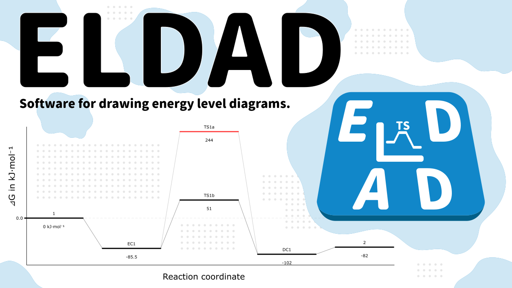

# ELDAD

Software for drawing energy level diagrams of chemical reactions.  
For more details on ELDAD, please go to [http://pc-chem-basics.blog.jp/archives/27912691.html](http://pc-chem-basics.blog.jp/archives/27912691.html)  

ELDAD uses [rxnlvl](https://github.com/eutactic/rxnlvl) and [CairoSVG](https://github.com/Kozea/CairoSVG) as external Python packages.  

Windons executable can be downloaded on the following link:  
[**ELDAD.zip**](https://github.com/RyokoKuga/ELDAD/releases/download/2.0.0/ELDAD.zip)
